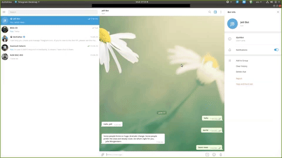

# Telegram_bot(@JelilBot)



## Preface

> A telegram bot that can be initialized on the command line(windows) / terminal(mac &amp; linux) where it responds to specific commands - ```/hello```, ```/quote```, or ```/latest news```.
You can type these commands without prefixing them with the foreward stick(```/```)
You may search for the bot on telegram with the username @JelilBot.

## Purpose

> This is a capstone/assessment project for the ruby module microverse curriculum .

- [Preface](#preface)
- [Purpose](#purpose)
- [Features](#features)
- [Presentations](#presentations)
- [Built With](#built-with)
- [Quick Start](#quick-start)
- [Dependencies](#dependencies)
- [Testing](#testing)
- [Author](#author)
- [Contributing](#contributing)

## Features

- The bot has two main features
- Ability to give you the latest news updates from the BBC website.
- It also gives motivational quotes with the author's name.

### Commands To Use

```console
latest news
```

```console
quote
```

```console
hello
```

 ```console
start
```

## Presentations

- You can watch the [video presentation](https://youtu.be/teb6WqpdRos) here.

## Built With

- Ruby 2.6.5
- VS Code
- Telegram Bot API
- Type fit Quotes API

## Quick Start

### How To Get a Local Copy

- Get  a local copy with:

```console
git clone https://github.com/JelilFaisalAbudu/telegram_bot
```

Or download it as a [Zip File](https://github.com/JelilFaisalAbudu/telegram_bot/archive/master.zip). using the green button (Clone or Download) on top of this page.

- Install Ruby in your system. To install Ruby, you can read the [Documentation](https://www.ruby-lang.org/en/documentation/installation/)

- Navigate to your telegram account if you have one. Or create new telegram account.
- Create a new bot with the help of BotFather. Use this documentation if you are facing challenges [New Bot](https://core.telegram.org/bots#6-botfather).
- Obtain your new bot's token.
- Go to the Bot class and assign your token to

```console
  TOKEN
```

variable.

#### Run on terminal/prompt

If you are on windows:

*- Go inside the project folder

*- Right shift '+' right mouse click (Float menu)

*- Open prompt here (Option)

```js
ruby bin/main.rb
```

- On your telegram account search for your bot's name

- Then press the /START button begin interacting.

## Dependencies

- rspec
- telegram_bot

## Testing

Install Rspec gem in your system. To do this:

Open Command Prompt or Terminal and run:

```console
gem install Rspec
```

Navigate into the project folder and run the following command in the console:

```console
rspec
```

## Authors 

👤 **Jelil Faisal Abudu**

- Github: [@JelilFaisalAbudu](https://github.com/JelilFaisalAbudu)
- Twitter: [@JelilAbudu](https://twitter.com/jelilabudu)
- Linkedin: [jelilfaisalabudu](https://linkedin.com/in/jelilfaisalabudu)

## 🤝 Contributing

Contributions, issues and feature requests are welcome!
Feel free to check the [issues page](https://github.com/JelilFaisalAbudu/tic_tac_toe_game/issues).

## Show your support
